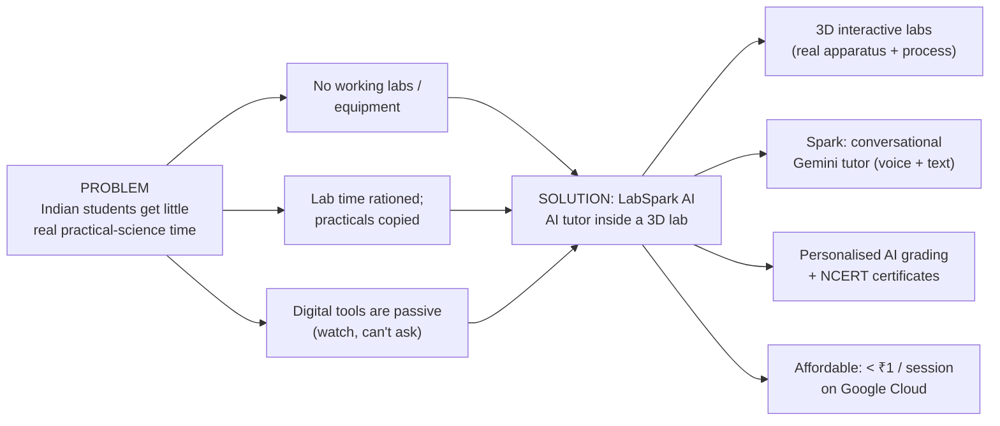
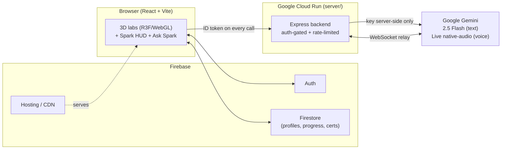
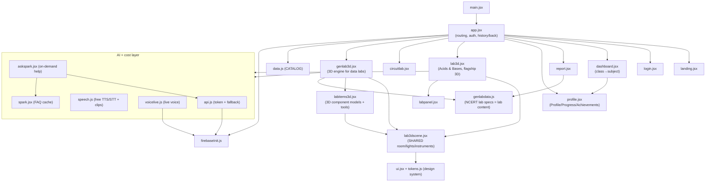
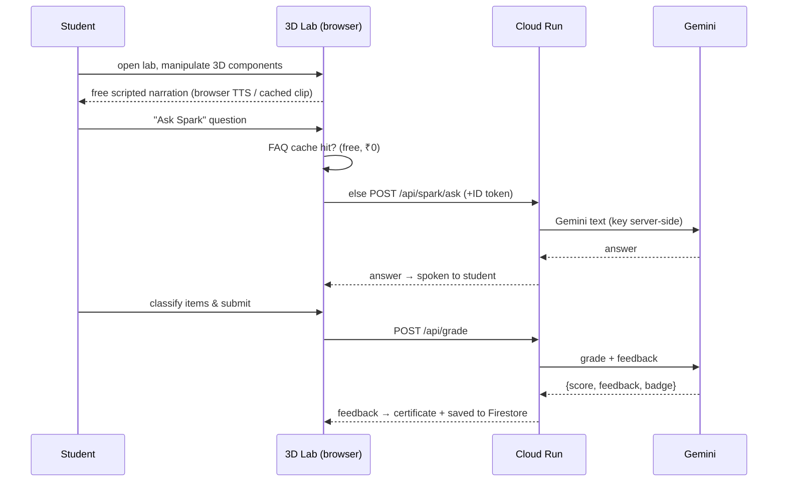
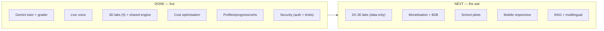

# LabSpark AI — Context Graph

> **Purpose:** a single, persistent map of the *problem → solution → architecture → code* so context is never lost between sessions. (The `/build-graph` SQLite code-graph MCP isn't connected in this environment, so this Markdown graph + the `memory/` files serve that role. GitHub renders the Mermaid diagrams below.)

---

## 1. Problem → Solution Map

---

## 2. System Architecture

**Endpoints (`server/index.js`):** `POST /api/spark/ask` (text) · `POST /api/grade` (JSON) · `WS /api/live` (voice relay) · `GET /health`. All `/api/*` require a Firebase ID token; limits 20/min, 300/day per user; CORS locked to the app domains.

---

## 3. Code / Module Graph (frontend)

**Scaling lever:** a new lab = one spec object in `genlabdata.js` (shape, color, category, mode). `genlab3d.jsx` + `labitems3d.jsx` render it in the shared 3D room automatically — *no new engineering per lab*.

---

## 4. Student / AI Data Flow

---

## 5. Status / Roadmap

---

## Key facts (quick recall)
- **Live app:** https://gen-lang-client-0686614374.web.app · **Repo:** https://github.com/ojha-436/LabSparkAI
- **Local path:** `D:\google_Xbuild\LabSpark_AI` (moved off OneDrive to stop node_modules corruption)
- **Backend:** Cloud Run `labspark-backend` (asia-south1) · model `gemini-2.5-flash`, live `gemini-3.1-flash-live-preview`
- **5 labs:** acid-base (3D flagship), circuit (2.5D), solubility, magnetism, metals-nonmetals (3D via engine)
- **Docs:** `PROJECT_OVERVIEW.md` (pitch), `DESIGN_HANDOFF.md` (design system), `PRD_LabSpark_AI.md`, `README.md`, this file
- **Deliverables:** `LabSpark_AI_Pitch_Deck.pptx`
- Full session history lives in the auto-memory at `memory/labspark-overview.md`.
