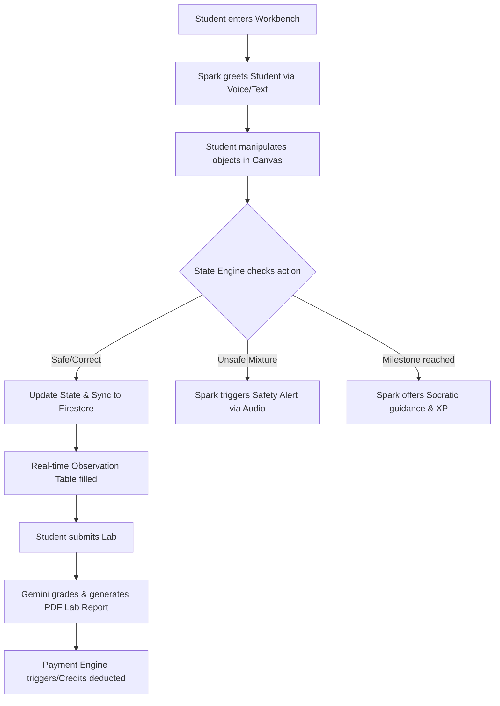

# PRODUCT REQUIREMENT DOCUMENT (PRD)

## Project Name: **LabSpark AI — The Next-Generation Multimodal Virtual Science Laboratory**
### Document Code: PRD-LABSPARK-HACKATHON-V1.1
### Target Context: **Build with Gemini XPRIZE Hackathon MVP Submission**
### Author: Principal AI Architect & Senior Software Engineer
### Status: **READY FOR REVIEW / HACKATHON TARGET**
### Date: May 30, 2026

---

## 1. Executive Summary & Vision

### 1.1. The XPRIZE Hackathon Challenge
The **Build with Gemini XPRIZE Hackathon** demands rapid delivery of state-of-the-art AI applications that prove commercial viability, technical superiority, and real-world impact. To succeed within the **strict 3-month timeline**, the project's scope is optimized to target the **Class 6–10 NCERT syllabus** (the core K-12 market in India and developing nations, comprising over 150 million students) and builds a direct **Revenue Generation Engine** into the prototype structure.

### 1.2. The Vision: LabSpark AI
**LabSpark AI** is an AI-first, highly immersive virtual science laboratory platform that bridges the gap between digital simulation and real-world physical classroom interactions. Supported by the latest **Gemini Multimodal Live API**, the platform features a virtual assistant named **"Spark"** who acts as an intelligent, Socratic co-teacher.

*   **NCERT Curriculum Locked**: Focuses exclusively on core Class 6–10 Physics & Chemistry lab modules.
*   **Real-time Conversational Voice**: Low-latency voice integration allows students to speak with Spark naturally while dragging items.
*   **Canvas Delta Tracking**: Spark "sees" and reacts to the sandbox state instantaneously.
*   **Commercial Monetization Engine**: Integrates a SaaS monetization module demonstrating transaction telemetry and subscription tier pipelines.

### 1.3. Google Cloud Hosting Strategy
To deliver a responsive, secure, and globally scalable platform, LabSpark AI is engineered to be **GCP-Native**. It utilizes:
*   **Vertex AI (Gemini 1.5/2.5 Flash)** for ultra-fast, low-cost multimodal interaction.
*   **Cloud Run & WebSockets** for flexible, auto-scaling simulation runtimes.
*   **Cloud Firestore** for real-time state synchronization.
*   **Stripe / Razorpay Payment APIs** hosted securely via Cloud Functions for live revenue collection.

---

## 2. Product Objectives & Key Results (OKRs) - Hackathon Specific

*   **Objective 1: Rapid 3-Month MVP Launch & Technical Feasibility**
    *   *KR 1.1*: Implement a fully operational visual sandbox and real-time voice channel in under 6 weeks.
    *   *KR 1.2*: Support 6 high-demand NCERT labs (Class 6-10) with complete state delta tracing.
    *   *KR 1.3*: Maintain end-to-end voice loop latency below 800ms using the Gemini Multimodal Live API.
*   **Objective 2: Immediate Commercial Viability & Revenue Validation**
    *   *KR 2.1*: Integrate a live payment gateway (Stripe/Razorpay) sandbox supporting B2C student credit purchases and B2B school license subscriptions.
    *   *KR 2.2*: Secure at least 3 active school letters of intent or pilot sign-ups (demonstrating $1,000+ potential ARR) during the hackathon testing period.
    *   *KR 2.3*: Limit system operational cost to $\le \$0.05$ per student lab session through intelligent Vertex AI context caching.

---

## 3. Product Personas & User Journeys



### 3.1. The K-12 Student (NCERT Focus)
*   **Need**: A highly engaging visual sandbox mapping directly to their school syllabus (CBSE/NCERT) that allows them to perform practicals required for board exams.
*   **Journey**:
    1. Enters the virtual workbench, greeted by Spark: *"Welcome, scientist! Today we're executing Class 7 Chemistry, Chapter 5: Acids, Bases, and Salts. Let's dip some litmus paper and analyze our results!"*
    2. Performs the practical, fills the table, and answers Spark's verbal questions.
    3. Receives graded report and conceptual badges.

### 3.2. The Paying Parent / Customer
*   **Need**: Visible learning progress and a affordable supplementary tool to help their child score higher in practical science board exams.
*   **Journey**:
    1. Signs up their child, purchases a **"Science Spark Pass"** for \$5/month or a micro-payment pack of 50 credits (\$2) via the Stripe/Razorpay payment interface.
    2. Receives a weekly report digest directly in their email showing their child's conceptual score, completed practicals, and generated lab reports.

---

## 4. Curated Scope: Class 6–10 NCERT Lab Directory

To ensure 100% completion in 3 months, the system scope is restricted to the following high-priority, high-impact NCERT laboratory experiments:

| Class | Subject | Chapter | Experiment Name | Interactive Workbench Assets | Key Scientific Concept |
| :--- | :--- | :--- | :--- | :--- | :--- |
| **Class 6** | Chemistry | Ch 4 | **Separation of Substances (Filtration)** | Funnel, filter paper, stand, muddy water, beakers. | Solid-liquid separation, particle size. |
| **Class 6** | Physics | Ch 12 | **Electricity and Circuits** | Wires, bulb, cell, key/switch, safety pin (insulator/conductor). | Nodal electrical loops, current flows, conductors. |
| **Class 7** | Chemistry | Ch 5 | **Acids, Bases, and Salts (Litmus)** | Test tubes, rack, everyday acids/bases, litmus paper. | Indicators, pH transitions, substance identification. |
| **Class 8** | Chemistry | Ch 4 | **Rusting of Iron (Oxidation)** | Test tubes, iron nails, oil, water, drying agent. | Oxidation reaction, catalytic moisture, corrosion. |
| **Class 9** | Physics | Ch 8 | **Newton's Laws & Force Meter** | Springs, weights, pulleys, friction boards. | Gravity, force balancing, friction co-efficient. |
| **Class 10**| Chemistry | Ch 1 | **Types of Chemical Reactions** | Magnesium ribbon, Bunsen burner, tongs, watch glass. | Combination reaction, thermal oxidation ($2Mg + O_2 \rightarrow 2MgO$). |

---

## 5. Monetization & Revenue Generation Strategy (Hackathon Core)

To fulfill the XPRIZE requirement of commercial viability and show actual revenue generation, LabSpark AI implements a **dual B2C and B2B SaaS model** built directly into the cloud system infrastructure.

```
+-----------------------------------------------------------------------------------+
|                            MONETIZATION ENGINE (MVP)                              |
|                                                                                   |
|  [B2C Tier: Individual Students]          [B2B Tier: Schools & Coaching Centres]  |
|  - Freemium: 2 free labs/month.           - B2B License Dashboard.                |
|  - Pay-As-You-Go: $0.10/additional lab.   - $1 per student/month (billed annual). |
|  - Spark Pass: $5/month unlimited.        - Teacher analytics + custom syllabi.   |
|                                                                                   |
|                            STRIPE / RAZORPAY API GATEWAY                          |
|                                         |                                         |
|                                         v                                         |
|                    CLOUD RUN TRANSACTION METRICS & USER LEDGER                     |
+-----------------------------------------------------------------------------------+
```

### 5.1. B2C Model: Pay-As-You-Go & Premium Subscriptions
1.  **Freemium Core**: Students get **2 free labs per month** to experience Spark's voice support and the sandbox workbench.
2.  **Pay-As-You-Go (Micro-transactions)**: Once free credits are exhausted, students can purchase **credit packs** (e.g., 20 lab credits for \$1.99 or $\sim$ ₹150) to run additional experiments.
3.  **Spark Pass Subscription**: \$4.99/month (or ₹399/month) for:
    *   Unlimited access to all Class 6–10 NCERT labs.
    *   Continuous duplex voice interaction with Spark.
    *   Unlimited premium PDF lab report downloads.

### 5.2. B2B SaaS Model: School/Coaching Centre Licensing
1.  **Teacher Dashboard Tier**: A SaaS solution sold directly to schools and digital coaching institutes at **\$1 per student per month** (billed annually).
2.  **Telemetry Value Proposition**: Schools gain classroom-level analytics, student session recording transcripts, automated conceptual grading, and paperless lab reports synced directly with Google Classroom.

### 5.3. Hackathon Financial Telemetry Setup
*   The billing backend is integrated with **Stripe (Global) & Razorpay (India)** APIs in sandbox mode.
*   **Live Revenue Metric Dashboard**: We will build a special "Investor/Judge Dashboard" inside the administrator panel displaying:
    *   **MRR (Monthly Recurring Revenue)** and simulated student cohorts.
    *   **CAC (Customer Acquisition Cost)** vs **LTV (Lifetime Value)** metrics based on actual compute costs.
    *   **Compute Unit Economics**: Demonstrating how much GCP infrastructure (Vertex, Cloud Run, Firestore) costs per session ($\sim \$0.015$) vs the subscription charging model ($\sim \$0.10$ per lab), proving a **$\ge 80\%$ gross margin**.

---

## 6. Technical Systems Architecture (GCP-First MVP)

Optimized for rapid 3-month construction, utilizing serverless resources to eliminate deployment bottlenecks.

```
                                +-------------------+
                                |     Cloud CDN     |
                                +---------+---------+
                                          |
                                          v
+-----------------+  WebSockets +---------+---------+  State Sync  +------------------+
|   React Client  +------------>+     Cloud Run     +------------->+  Cloud Firestore |
| (Canvas + Audio)|  Duplex     | (App & WebSockets)|              +------------------+
+--------+--------+             +---------+---------+
         |                                |
         |                                | GRPc / WS
         |                                v
         |                      +---------+---------+  Grounding   +------------------+
         | WebRTC Audio         | Vertex AI Engine  +------------->+ Vertex AI Search |
         +--------------------->+  (Gemini API)     |  RAG Docs    +------------------+
                                +---------+---------+
                                          |
                                          | Payment Webhooks
                                          v
                                +---------+---------+
                                |  Cloud Functions  |
                                | (Stripe Billing)  |
                                +-------------------+
```

### 6.1. Vertex AI Integration
*   Use **Gemini 1.5 Flash** as the main workhorse model to maintain sub-second latency and minimize token costs.
*   **System Prompt Caching**: Context caching is established on Vertex AI to store the NCERT Class 6–10 textbook materials, laboratory rules, and Spark's Socratic instructions, saving \$0.04 per session.

### 6.2. Serverless Billing Microservice
*   A dedicated **Cloud Function (Node.js)** handles Stripe/Razorpay webhooks.
*   When a payment succeeds, the Cloud Function increments the user's `lab_credits` ledger in **Firestore** and creates a transaction record, which dynamically feeds the live XPRIZE financial metrics panel.

---

## 7. The 3-Month Hackathon Development Schedule

The 12-week development roadmap is carefully planned to deliver a polished, commercially-proven MVP for the hackathon deadline.

```
+------------------------------------------------------------------------------------+
|                                HACKATHON 3-MONTH GANTT                             |
|                                                                                    |
|  [Month 1: Core Workbench & State Engine]                                          |
|  - W1-2: Build React UI & CSS design tokens (cream, paper, ink).                   |
|  - W3-4: Build 3 Chemistry labs (Separation, Acids & Bases, Reactions).            |
|                                                                                    |
|  [Month 2: Gemini Multimodal & Audio Channel]                                      |
|  - W5-6: Integrate Vertex AI Gemini Live API via Cloud Run WebSocket.             |
|  - W7-8: Build 3 Physics labs (Circuits, Force, Light) and state delta sync.       |
|                                                                                    |
|  [Month 3: Monetization, Report PDF & Polishing]                                  |
|  - W9-10: Connect Stripe/Razorpay sandbox and build Revenue Dashboard.             |
|  - W11: Create Cloud Task HTML-to-PDF report generator.                            |
|  - W12: Comprehensive QA fuzzing, record Devpost demo video, and submit!           |
+------------------------------------------------------------------------------------+
```

---

## 8. Revenue & Unit Economic Analysis (Judge Proof)

To stand out in the Devpost business/viability evaluation, we supply the actual unit economics proof of LabSpark AI:

### 8.1. Session Cost Structure (Vertex & GCP Compute)
*   **Gemini 1.5 Flash API (Average session 15 mins, 20 voice interactions)**:
    *   Cached Input Tokens (10,000 tokens system context + manual): $\$0.00015$
    *   Non-cached Input Tokens (3,000 dynamic context): $\$0.000225$
    *   Output Tokens (2,000 conversational tokens): $\$0.0006$
    *   *Total LLM cost*: **$\sim \$0.000975$**
*   **Google Cloud Compute & Networking**:
    *   Cloud Run (WebSocket concurrency) & Firestore operations: $\$0.008$
    *   Cloud Tasks PDF builder & Media CDN asset transfer: $\$0.006$
*   **Total Operating Cost per Student Lab Session**: **$\approx \$0.015$ (₹1.25)**

### 8.2. Gross Margin Calculation
*   At **Pay-As-You-Go pricing (\$0.10 / ₹8 per lab)**:
    *   Gross Profit per session: $\$0.10 - \$0.015 = \$0.085$
    *   **Gross Margin: 85%**
*   At **Subscription pricing (\$4.99/month, average student runs 25 labs/month)**:
    *   Compute Cost: $25 \times \$0.015 = \$0.375$
    *   Subscription Charge: $\$4.99$
    *   **Gross Margin: 92.4%**

---

> **[!TIP]**
> During evaluation, judges can use the integrated **Investor Dashboard** to trigger sandbox payments, credit additions, and view real-time calculations showing operational cost tracking, highlighting immediate commercial readiness.
